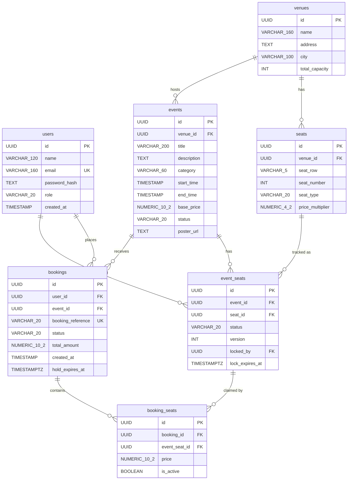

# DEEP_EXPLANATION.md — Ticket Booking System
> **For: live technical interview defence.**  
> Every claim in this file is grounded in a real file, class, function, table or column
> that exists in the repo at the time of writing. File paths are exact.

---

## 1. Project Map

### Backend (`Backend/`)

| Path | What lives there |
|------|-----------------|
| `src/main/kotlin/com/ticketbooking/Application.kt` | Entry point; calls plugin installers in order, bootstraps admin account |
| `src/main/kotlin/com/ticketbooking/plugins/DatabaseFactory.kt` | HikariCP pool creation, `SELECT 1` connectivity proof, schema verification hook |
| `src/main/kotlin/com/ticketbooking/plugins/Components.kt` | Manual dependency-injection graph (`AppComponents`); reads all config |
| `src/main/kotlin/com/ticketbooking/plugins/Routing.kt` | Composes all controller route-extension functions under `/api` |
| `src/main/kotlin/com/ticketbooking/plugins/Security.kt` | Ktor `Authentication` plugin; JWT bearer provider; `requireUser` / `requireAdmin` helpers |
| `src/main/kotlin/com/ticketbooking/plugins/StatusPages.kt` | Single error-response funnel: `ApiException` → HTTP status + `ApiError` JSON |
| `src/main/kotlin/com/ticketbooking/plugins/Serialization.kt` | Installs `ContentNegotiation` with `kotlinx.serialization` JSON |
| `src/main/kotlin/com/ticketbooking/plugins/Monitoring.kt` | CORS, call-logging, default headers |
| `src/main/kotlin/com/ticketbooking/plugins/HoldSweeping.kt` | Starts `HoldSweeper` coroutine, cancels it on `ApplicationStopping` |
| `src/main/kotlin/com/ticketbooking/plugins/SchemaVerifier.kt` | Fail-fast check that required columns / indexes exist in the live DB |
| `src/main/kotlin/com/ticketbooking/controller/AuthController.kt` | Route handlers for `POST /auth/register`, `POST /auth/login`, `GET /auth/me` |
| `src/main/kotlin/com/ticketbooking/controller/EventController.kt` | Route handlers for public event browsing and seat-map |
| `src/main/kotlin/com/ticketbooking/controller/BookingController.kt` | Route handlers for hold, confirm, list, get, cancel (user-facing) |
| `src/main/kotlin/com/ticketbooking/controller/AdminController.kt` | Route handlers for all `/admin/*` endpoints |
| `src/main/kotlin/com/ticketbooking/service/AuthService.kt` | Registration, login (with timing-equalised dummy hash), `ensureBootstrapAdmin` |
| `src/main/kotlin/com/ticketbooking/service/BookingService.kt` | `holdSeats`, `confirmBooking`, `cancelBooking`, `listMyBookings`, `sweepExpiredHolds` |
| `src/main/kotlin/com/ticketbooking/service/AdminBookingService.kt` | Admin-only booking listing (paginated) and admin cancel (no ownership check) |
| `src/main/kotlin/com/ticketbooking/service/EventService.kt` | Public event list/filter/detail (PUBLISHED only) |
| `src/main/kotlin/com/ticketbooking/service/EventAdminService.kt` | Create, update, cancel (soft-delete) events; auto-generates `event_seats` rows |
| `src/main/kotlin/com/ticketbooking/service/SeatService.kt` | Seat-map assembly with lazy-expiry logic; `priceFor` pricing formula |
| `src/main/kotlin/com/ticketbooking/service/VenueService.kt` | Venue CRUD; bulk seat-layout expansion (rows x seatsPerRow → `seats` rows) |
| `src/main/kotlin/com/ticketbooking/service/HoldSweeper.kt` | Background coroutine loop; calls `BookingService.sweepExpiredHolds` every 5 min |
| `src/main/kotlin/com/ticketbooking/repository/TransactionRunner.kt` | `ExposedTransactionRunner` (production) and `DirectTransactionRunner` (tests) |
| `src/main/kotlin/com/ticketbooking/repository/BookingRepository.kt` | Interface; methods: `create`, `findById`, `findDetailById`, `search`, `findExpiredHolds`, etc. |
| `src/main/kotlin/com/ticketbooking/repository/SeatRepository.kt` | Interface; methods: `lockEventSeatsForUpdate`, `markLocked`, `markBooked`, `markAvailable`, `releaseExpiredLocks` |
| `src/main/kotlin/com/ticketbooking/repository/EventRepository.kt` | Interface; search, find-with-venue, create, update, updateStatus |
| `src/main/kotlin/com/ticketbooking/repository/impl/PostgresBookingRepository.kt` | Exposed DSL implementation of `BookingRepository` |
| `src/main/kotlin/com/ticketbooking/repository/impl/PostgresSeatRepository.kt` | Exposed DSL; contains `lockEventSeatsForUpdate` (`.forUpdate()`) |
| `src/main/kotlin/com/ticketbooking/repository/impl/PostgresEventRepository.kt` | Exposed DSL implementation of `EventRepository` |
| `src/main/kotlin/com/ticketbooking/repository/impl/PostgresUserRepository.kt` | Exposed DSL; `findByEmail`, `existsByEmail`, `create`, `findById` |
| `src/main/kotlin/com/ticketbooking/repository/impl/PostgresVenueRepository.kt` | Exposed DSL; `findAll`, `findById`, `create`, `updateCapacity` |
| `src/main/kotlin/com/ticketbooking/model/` | 7 Exposed table objects + companion Kotlin data classes |
| `src/main/kotlin/com/ticketbooking/dto/` | All `@Serializable` request/response shapes |
| `src/main/kotlin/com/ticketbooking/util/JwtUtil.kt` | `generateToken`, `extractUser`; HMAC-SHA256; configurable expiry |
| `src/main/kotlin/com/ticketbooking/util/PasswordHasher.kt` | BCrypt cost-12 hashing and constant-time verification |
| `src/main/kotlin/com/ticketbooking/util/TimeProvider.kt` | Injects `Clock` for testability; `nowUtc()` (TIMESTAMP), `nowOffset()` (TIMESTAMPTZ) |
| `src/main/kotlin/com/ticketbooking/util/ApiException.kt` | Sealed hierarchy: `ValidationException`, `UnauthorizedException`, `ForbiddenException`, `NotFoundException`, `ConflictException`, `SeatsUnavailableException` |
| `src/main/kotlin/com/ticketbooking/util/Validators.kt` | Centralised input normalisation (trim, lowercase email, UUID parse, range checks) |
| `src/main/resources/application.conf` | HOCON; all `app.*` keys with env-var overrides via `${?ENV_NAME}` |
| `db/01_schema.sql` | Seven tables, base constraints |
| `db/02_deltas.sql` | Three required additions: lock ownership columns, `hold_expires_at`, `is_active` + partial unique index |

### Frontend (`Frontend/`)

| Path | What lives there |
|------|-----------------|
| `index.html` | Event listing with search + filter form |
| `event.html` | Event detail, seat map, seat selection |
| `booking.html` | Hold review and confirm/release actions |
| `my-bookings.html` | Booking history + cancellation |
| `login.html` | Sign-in form |
| `register.html` | Account creation form |
| `admin/dashboard.html` | Admin entry page |
| `admin/manage-events.html/.js` | Admin event CRUD |
| `admin/manage-venues.html/.js` | Admin venue + seat-layout management |
| `admin/manage-bookings.html/.js` | Admin paginated booking list and cancel |
| `admin/admin-common.js` | ADMIN role guard; shared form-submission helpers |
| `js/api.js` | **The only module that talks to the backend** — URL, token, error envelope |
| `js/session.js` | `requireSignIn()` guard; validated same-origin `?next=` redirect |
| `js/nav.js` | Shared header/footer shell, `showStatus`, `describeError` |
| `js/format.js` | Money (integer paise), date/time, `sumMoney`, `hasEventStarted` |
| `js/events.js` | Event listing page logic |
| `js/seatmap.js` | Seat-map render, roving-tabindex keyboard nav, hold flow |
| `js/booking.js` | Hold review, confirm, release page |
| `js/bookings.js` | Booking history list and cancel |
| `js/auth.js` | Login + register pages (switched by `data-mode`) |
| `css/styles.css` | Single stylesheet; CSS Grid for seat/card layouts, Flexbox for bars |

---

## 2. Architecture — As Actually Implemented

### Request flow (using actual class names)

```
Browser (fetch() / api.js)
  |
  | Authorization: Bearer <JWT>
  v
Ktor Security plugin (Security.kt — authenticate(JWT_AUTH))
  |  verifies signature, issuer, audience, expiry via JwtUtil.verifier
  v
Controller (AuthController / EventController / BookingController / AdminController)
  |  parse inputs, call requireUser()/requireAdmin(), delegate
  v
Service (AuthService / BookingService / EventService / SeatService / VenueService /
         EventAdminService / AdminBookingService / HoldSweeper)
  |  all business rules: validation, locking, pricing, expiry, role logic
  v
ExposedTransactionRunner (TransactionRunner.kt) — wraps in one DB transaction
  |
  v
Repository impl (PostgresBookingRepository / PostgresSeatRepository /
                 PostgresEventRepository / PostgresUserRepository / PostgresVenueRepository)
  |  Exposed DSL → SQL
  v
Supabase PostgreSQL (HikariCP pool, DatabaseFactory.kt)
```

### MVC mapping — exact files

| Layer | Files | Role |
|-------|-------|------|
| **Model** | `model/*.kt` (Exposed `Table` objects + data classes), `repository/` (interfaces + `impl/Postgres*.kt`) | Database schema definition and all data access; zero business rules |
| **View** | `Frontend/` (all HTML + JS + CSS) | Presentation; calls the API via `api.js`; never directly touches the DB |
| **Controller** | `controller/AuthController.kt`, `controller/EventController.kt`, `controller/BookingController.kt`, `controller/AdminController.kt` | Receive HTTP, parse inputs, delegate to services, respond. Comment in `AuthController.kt` L26: *"parse, delegate, respond. All rules live in AuthService"* |
| **Service** | `service/BookingService.kt`, `service/AuthService.kt`, etc. | **Refinement of classic MVC**: all business rules (locking logic, pricing, expiry, role checks, validation). Keeps controllers thin and rules unit-testable without HTTP |

Why the Service layer exists: `BookingController.kt` is only 97 lines and contains zero business rules. Every seat-locking, pricing, expiry and availability rule lives in `BookingService.kt`. This means all 265 service unit tests run against in-memory fake repositories with no HTTP and no database. Without the service layer, controllers would grow to hundreds of lines and become untestable in isolation.

---

## 3. Feature-by-Feature Deep Dive

### 3.1 Authentication (Auth)

**User perspective:** Create an account, log in to get a JWT, use the JWT on every authenticated call.

**Endpoints** (defined in `controller/AuthController.kt`, wired at `Routing.kt` L28):

| Method | Path |
|--------|------|
| `POST` | `/api/auth/register` |
| `POST` | `/api/auth/login` |
| `GET`  | `/api/auth/me` |

**Call chain — register:**

```
AuthController.authRoutes() → post("/register")
  → call.receive<RegisterRequest>()
  → AuthService.register(request)
      → Validators.validateName / validateEmail / validatePassword
      → PasswordHasher.hash(password)           # BCrypt cost-12, OUTSIDE the transaction
      → transactions.inTransaction {
            users.existsByEmail(email) → ConflictException if duplicate
            users.create(...)
        }
  → call.respond(201, UserResponse)
```

**Why BCrypt runs outside the transaction:** `PasswordHasher.kt` comment (L54-55): BCrypt at cost 12 takes hundreds of milliseconds. Holding a HikariCP connection through that would waste a scarce pooled connection. Hash first, then open the transaction.

**Call chain — login:**

```
AuthController.authRoutes() → post("/login")
  → AuthService.login(request)
      → Validators.validateEmail(request.email)
      → transactions.inTransaction { users.findByEmail(email) }
      → if null: hasher.verify(password, DUMMY_HASH) then throw UnauthorizedException
        # Timing equalization: both paths spend ~same time, preventing user-enumeration
      → if wrong password: throw UnauthorizedException
      → jwt.generateToken(user.id, user.email, user.role)
  → call.respond(200, AuthResponse(token, expiresIn, user))
```

**DTOs (from `dto/AuthDto.kt`):**

```kotlin
data class RegisterRequest(val name: String? = null, val email: String? = null, val password: String? = null)
data class LoginRequest(val email: String? = null, val password: String? = null)
data class AuthResponse(val token: String, val expiresIn: Long, val user: UserResponse)
data class UserResponse(val id: String, val name: String, val email: String, val role: String)
```

**Edge cases handled:**
- Duplicate email → `409 EMAIL_ALREADY_REGISTERED`
- Unknown email vs wrong password → same `401 UNAUTHORIZED` message and similar timing (dummy hash path, `AuthService.kt` L96-98)
- Self-registration cannot set `role: "ADMIN"` — `AuthService.register` hard-codes `Role.USER` (L70)
- Password not trimmed (`Validators.kt` L54): leading/trailing spaces are valid characters
- Password validated against BCrypt's 72-byte limit (`Validators.kt` L62-69)

**Edge cases NOT handled:**
- No rate limiting on login; BCrypt slows brute force but a per-IP limit is absent (noted in `README.md` §8)

---

### 3.2 Event Listing and Filtering

**User perspective:** Browse published events with free-text search and city/category/date filters.

**Endpoints** (defined in `controller/EventController.kt`):

| Method | Path |
|--------|------|
| `GET` | `/api/events` |
| `GET` | `/api/events/filters` |
| `GET` | `/api/events/{id}` |

**Call chain — list:**

```
EventController.eventRoutes() → get
  → query params: search, city, category, date, upcomingOnly
  → EventService.listEvents(search, city, category, date, upcomingOnly=false)
      → EventFilter(statuses = setOf(EventStatus.PUBLISHED), ...)  # public never sees DRAFT/CANCELLED
      → transactions.inTransaction { events.search(filter) }
      → .map { it.toSummaryResponse() }
  → call.respond(200, List<EventSummaryResponse>)
```

`GET /api/events/filters` is declared **before** `/{id}` in `EventController.kt` (L42 comment) specifically so the literal path `"filters"` is not captured as a UUID path parameter.

**DTOs (from `dto/EventDto.kt`):**

```kotlin
data class EventSummaryResponse(
    val id: String, val title: String, val category: String?,
    val city: String, val venueName: String, val startTime: String,
    val endTime: String, val basePrice: String, val posterUrl: String?, val status: String
)
data class EventDetailResponse(
    val id: String, val title: String, val description: String?,
    val category: String?, val startTime: String, val endTime: String,
    val basePrice: String, val posterUrl: String?, val status: String, val venue: VenueSummaryResponse
)
data class EventFiltersResponse(val cities: List<String>, val categories: List<String>)
```

**Edge cases handled:**
- Blank filter strings treated as absent (`EventService.kt` L52-54)
- DRAFT event returns `404 NOT_FOUND` (not `403`) from public route — `EventService.kt` L67-68
- Malformed `date` parameter → `400 VALIDATION_ERROR` (`EventService.kt` L107)

---

### 3.3 Seat Map

**User perspective:** See every seat for an event with its availability and price before choosing seats.

**Endpoint** (in `controller/EventController.kt` L57):

| Method | Path |
|--------|------|
| `GET` | `/api/events/{id}/seats` |

Public — no auth required. The response exposes nothing about who holds a seat.

**Call chain:**

```
EventController → get("/{id}/seats")
  → SeatService.getSeatMap(rawEventId)
      → Validators.parseUuid(rawEventId, "id")
      → transactions.inTransaction {
            events.findById(eventId) or NotFoundException
            seats.findEventSeatMap(eventId)   # JOIN event_seats ⋈ seats, ordered by row/number
        }
      → if !event.isPublic → NotFoundException
      → rows.map { row.toSeatResponse(event, now) }
          # LAZY EXPIRY: eventSeat.effectiveStatus(now) reports LOCKED-but-expired as AVAILABLE
          # price = SeatService.priceFor(event.basePrice, seat.priceMultiplier)
      → SeatMapResponse(seats, summary)
  → call.respond(200, SeatMapResponse)
```

**DTOs (from `dto/SeatDto.kt`):**

```kotlin
data class SeatResponse(
    val eventSeatId: String, val row: String, val number: Int,
    val type: String, val price: String, val status: String
)
data class SeatMapResponse(val eventId: String, val seats: List<SeatResponse>, val summary: SeatMapSummary)
data class SeatMapSummary(val total: Int, val available: Int, val locked: Int, val booked: Int)
```

**Critical detail:** `eventSeatId` is the `event_seats.id` UUID — the per-event row, **not** the physical `seats.id`. This is what the client sends when holding. Without this distinction, the same physical seat could not have different statuses across different events.

**Pricing formula** (`SeatService.kt` L101-102):

```kotlin
fun priceFor(basePrice: BigDecimal, priceMultiplier: BigDecimal): BigDecimal =
    basePrice.multiply(priceMultiplier).setScale(2, RoundingMode.HALF_UP)
```

The same `priceFor` is used in the seat map AND in `BookingService.holdSeats` (L157), guaranteeing the price shown and the price charged are computed identically.

---

### 3.4 Seat Hold (most critical path in the codebase)

**User perspective:** Select seats and place a 24-hour hold, creating a `PENDING` booking.

**Endpoint** (in `controller/BookingController.kt`, `holdRoutes`, L28):

| Method | Path | Auth |
|--------|------|------|
| `POST` | `/api/events/{id}/hold` | Bearer JWT |

**Request DTO:**
```kotlin
data class HoldRequest(val eventSeatIds: List<String>? = null)
```

**Full call chain:**

```
BookingController.holdRoutes() → post
  → requireUser(jwtUtil)           # UnauthorizedException if no/invalid token
  → call.receive<HoldRequest>()
  → BookingService.holdSeats(caller.userId, rawEventId, request)
      → Validators.parseUuid(rawEventId, "id")
      → parseSeatIds(request.eventSeatIds)   # null/empty → 400; >10 → 400; duplicates → 400
      → now = time.nowOffset(); expiresAt = time.offsetPlusHours(24)
      → transactions.inTransaction {
            events.findById(eventId) ?: NotFoundException
            if event.status != PUBLISHED → ConflictException("EVENT_NOT_BOOKABLE")
            if event.hasStartedAt(now) → ConflictException("EVENT_ALREADY_STARTED")

            # THE ROW LOCK — PostgresSeatRepository.lockEventSeatsForUpdate()
            val locked = seats.lockEventSeatsForUpdate(eventId, requestedIds)
            # → SELECT ... FOR UPDATE ordered by event_seats.id (deadlock prevention)

            missing = requestedIds.filterNot { it in foundIds }
            if missing.isNotEmpty → NotFoundException

            # availability check (respects lazy expiry via isClaimableBy)
            unavailable = locked.filterNot { it.eventSeat.isClaimableBy(userId, now) }
            if unavailable.isNotEmpty → SeatsUnavailableException(409)

            # price each seat
            pricedSeats = locked.map { BookingSeatSpec(eventSeatId, price=priceFor(event.basePrice, seat.priceMultiplier)) }
            total = sum of prices

            # release any stale prior claims (user's own old hold or expired hold by another)
            releaseSupersededClaims(requestedIds, userId)

            seats.markLocked(requestedIds, userId, expiresAt)
            # → UPDATE event_seats SET status='LOCKED', locked_by=userId, lock_expires_at=expiresAt, version=version+1

            bookings.create(id, userId, eventId, "TB-XXXXXX", PENDING, total, now, expiresAt, pricedSeats)
            # → INSERT bookings + batchInsert booking_seats (is_active=true)
            # If uq_booking_seats_active is violated → whole transaction rolls back
        }
      → loadDetail(bookingId)  # second transaction to load the full response
  → call.respond(201, BookingResponse)
```

**Booking reference generation** (`BookingService.kt` L549-558): Format `"TB-XXXXXX"` where `X` is drawn from `"ABCDEFGHJKLMNPQRSTUVWXYZ23456789"` (no `O/0` or `I/1`, unambiguous to read aloud). Uses `SecureRandom`, checks uniqueness via `bookings.existsByReference`, retries up to 10 times. The `UNIQUE` constraint on `bookings.booking_reference` is the final backstop.

**Response DTO (from `dto/BookingDto.kt`):**
```kotlin
data class BookingResponse(
    val id: String, val bookingReference: String, val status: String,
    val totalAmount: String, val createdAt: String,
    val expiresAt: String?,    // present only while PENDING
    val event: BookingEventResponse, val seats: List<BookingSeatResponse>,
    val seatLabels: List<String>,
    val user: BookingUserResponse?   // present only in admin responses
)
```

---

### 3.5 Booking Confirmation

**User perspective:** After reviewing a hold, confirm it to turn it into a real booking.

**Endpoint** (in `controller/BookingController.kt` L58):

| Method | Path | Auth |
|--------|------|------|
| `POST` | `/api/bookings/{id}/confirm` | Bearer JWT |

**Call chain (from `BookingService.confirmBooking`):**

```
→ transactions.inTransaction {
      booking = bookings.findById(bookingId) ?: NotFoundException
      if booking.userId != userId → ForbiddenException      # ownership first
      when(booking.status):
        CONFIRMED → return (idempotent — double-click safe)
        CANCELLED → ConflictException("BOOKING_CANCELLED")
        EXPIRED   → ConflictException("HOLD_EXPIRED")
        PENDING   → proceed

      if booking.isHoldExpiredAt(now):
        # Lazy expiry path: close hold here instead of waiting for sweeper
        bookings.deactivateSeats(bookingId)
        bookings.updateStatus(bookingId, EXPIRED, clearHoldExpiry=true)
        seats.markAvailable(heldSeats)
        → ConflictException("HOLD_EXPIRED")

      heldSeatIds = bookings.findActiveEventSeatIds(bookingId)
      if heldSeatIds.isEmpty → ConflictException("BOOKING_HAS_NO_SEATS")

      # Re-lock and re-verify: between hold and confirm, the hold may have lapsed
      locked = seats.lockEventSeatsForUpdate(booking.eventId, heldSeatIds)
      stolen = locked.filterNot { isClaimableBy(userId, now) }
      if stolen.isNotEmpty → SeatsUnavailableException(409)

      seats.markBooked(heldSeatIds)
      # → UPDATE event_seats SET status='BOOKED', locked_by=null, lock_expires_at=null, version+1
      bookings.updateStatus(bookingId, CONFIRMED, clearHoldExpiry=true)
  }
```

**Idempotency:** Double-clicking "Confirm" or retrying the request is safe — the function returns the already-confirmed booking unchanged if `status == CONFIRMED`.

---

### 3.6 Booking History

**User perspective:** See all your own bookings and holds, newest first.

**Endpoints** (in `controller/BookingController.kt`):

| Method | Path | Auth |
|--------|------|------|
| `GET` | `/api/bookings/me` | Bearer JWT |
| `GET` | `/api/bookings/{id}` | Bearer JWT |

**Call chain:**

```
BookingService.listMyBookings(userId)
  → transactions.inTransaction { bookings.findDetailsByUser(userId) }
  # → SELECT bookings JOIN events JOIN venues WHERE user_id=? ORDER BY created_at DESC
  → .map { it.toResponse() }
```

`listMyBookings` is **read-only** by design (`BookingService.kt` L292-297). A hold whose deadline has lapsed but whose sweeper pass has not yet run still reports `PENDING` with a past `expiresAt`. Making a GET mutate data (auto-expiring on read) would violate REST semantics.

---

### 3.7 Booking Cancellation

**User perspective:** Cancel a hold or a confirmed booking to free the seats.

**Endpoint** (in `controller/BookingController.kt` L86):

| Method | Path | Auth |
|--------|------|------|
| `DELETE` | `/api/bookings/{id}` | Bearer JWT |

**Call chain (from `BookingService.cancelBooking`):**

```
→ transactions.inTransaction {
      booking = bookings.findById(bookingId) ?: NotFoundException
      if booking.userId != userId → ForbiddenException
      when(booking.status):
        CANCELLED → return (idempotent)
        EXPIRED   → ConflictException("HOLD_EXPIRED") — nothing to cancel
        CONFIRMED → check event.hasStartedAt(now): if yes → ConflictException("EVENT_ALREADY_STARTED")
        PENDING   → proceed always (freeing seats is never harmful)

      claimedSeatIds = bookings.findActiveEventSeatIds(bookingId)
      bookings.deactivateSeats(bookingId)
      # → UPDATE booking_seats SET is_active=false WHERE booking_id=? AND is_active=true
      bookings.updateStatus(bookingId, CANCELLED, clearHoldExpiry=true)
      if claimedSeatIds.isNotEmpty: seats.markAvailable(claimedSeatIds)
      # → UPDATE event_seats SET status='AVAILABLE', locked_by=null, lock_expires_at=null, version+1
  }
```

**Why `deactivateSeats` instead of deleting:** `booking_seats` rows are flipped to `is_active=false`. The partial unique index `uq_booking_seats_active` only counts `is_active=true` rows, so the seat is immediately available for resale while the cancelled booking retains its full seat history.

**Cancellation window:** A CONFIRMED booking can only be cancelled before `event.start_time`. A PENDING hold can always be cancelled. An admin cancelling via `DELETE /api/admin/bookings/{id}` (in `AdminBookingService.cancelBooking`) has **no** start-time restriction.

---

### 3.8 Admin Management

**User perspective (admin):** Manage venues, events, and view/cancel any user's booking.

**All endpoints under `/api/admin/*`** require two protections (`AdminController.kt` L28-33):
1. `authenticate(JWT_AUTH)` — validates JWT signature, issuer, audience, expiry → `401` if absent/invalid
2. `requireAdmin(jwtUtil)` — checks `AuthenticatedUser.isAdmin` → `403` if role is not ADMIN

#### Venues

| Method | Path | Handler chain |
|--------|------|---------------|
| `GET` | `/api/admin/venues` | `AdminController → VenueService.listVenues()` → `VenueRepository.findAll()` + `SeatRepository.countSeatsByVenue()` |
| `POST` | `/api/admin/venues` | `AdminController → VenueService.createVenue(CreateVenueRequest)` |
| `GET` | `/api/admin/venues/{id}` | `AdminController → VenueService.getVenue(rawId)` |
| `POST` | `/api/admin/venues/{id}/seats` | `AdminController → VenueService.generateSeatLayout(rawVenueId, SeatLayoutRequest)` |

`generateSeatLayout` expands `rows x seatsPerRow` into individual `seats` rows. If any generated label already exists, the **entire** request is refused — a partial layout would force the admin to figure out what was actually created (`VenueService.kt` L84-87).

#### Events

| Method | Path | Handler chain |
|--------|------|---------------|
| `POST` | `/api/admin/events` | `AdminController → EventAdminService.createEvent(CreateEventRequest)` |
| `PUT` | `/api/admin/events/{id}` | `AdminController → EventAdminService.updateEvent(rawId, UpdateEventRequest)` |
| `DELETE` | `/api/admin/events/{id}` | `AdminController → EventAdminService.cancelEvent(rawId)` |

**Creating an event** (`EventAdminService.createEvent`): In the **same transaction**, inserts the `events` row and batch-inserts one `event_seats` row per venue seat. If the venue has no seats, `409 VENUE_HAS_NO_SEATS` is thrown. An event with an empty seat map would be silently unbookable, so this step cannot be forgotten.

**`UpdateEventRequest`** — every field is nullable; omitted fields keep their current value. `venueId` is deliberately absent — moving an event to another venue would invalidate every existing booking (`AdminDto.kt` L96-99 comment).

#### Admin Bookings

| Method | Path | Handler chain |
|--------|------|---------------|
| `GET` | `/api/admin/bookings` | `AdminController → AdminBookingService.listBookings(eventId?, userId?, status?, limit?, offset?)` |
| `GET` | `/api/admin/bookings/{id}` | `AdminController → AdminBookingService.getBooking(rawId)` |
| `DELETE` | `/api/admin/bookings/{id}` | `AdminController → AdminBookingService.cancelBooking(actingAdminId, rawId)` |

Listing is **paginated** (default `limit=50`, max `200`). An out-of-range `limit` is `400` (not silently clamped). Admin cancel logs the acting admin's UUID at `WARN` level for audit trail. `AdminBookingService` has no ownership checks; it is separated from `BookingService` precisely so the two cannot accidentally acquire each other's constraints.

---

## 4. Database — Deep Dive

### 4.1 ER Diagram (from `db/01_schema.sql` + `db/02_deltas.sql`)



### 4.2 Table-by-table breakdown

**`users`** — Accounts. `role VARCHAR(20)` stores `'USER'` or `'ADMIN'`. No DB CHECK constraint; the application enforces the set via `Role.entries`. Passwords stored as BCrypt hashes in `password_hash TEXT`.

**`venues`** — Physical locations. `total_capacity INT` is advisory; the actual count comes from `seats` rows. `VenueService.generateSeatLayout` updates it via `venues.updateCapacity` after each layout call.

**`seats`** — The venue's fixed physical seat grid, created once per venue. `UNIQUE(venue_id, seat_row, seat_number)` in `01_schema.sql`. `price_multiplier NUMERIC(4,2)` — at most `99.99`.

**`events`** — A show at a venue on a date. `start_time` and `end_time` are timezone-naive `TIMESTAMP`; the application always writes UTC via `TimeProvider.nowUtc()`. `status VARCHAR(20)` with no CHECK constraint (see Drift §9).

**`event_seats`** — Per-event availability for each physical seat. `UNIQUE(event_id, seat_id)` prevents a seat having two rows for the same event. Added by `02_deltas.sql`: `locked_by UUID REFERENCES users(id)` and `lock_expires_at TIMESTAMPTZ`. The `TIMESTAMPTZ` (not `TIMESTAMP`) type is critical because a timezone-naive column compared against `now()` would expire holds at the wrong moment. `version INT` is incremented on every status change.

**`bookings`** — A booking or an unconfirmed hold. `status VARCHAR(20)` can be `PENDING | CONFIRMED | CANCELLED | EXPIRED`. Note: `EXPIRED` is not in the `01_schema.sql` comment but stores cleanly because there is no CHECK constraint (see §9, Drift). `hold_expires_at TIMESTAMPTZ` is added by `02_deltas.sql` and is populated only while `status = 'PENDING'`.

**`booking_seats`** — The seats inside a booking, at the price locked in at hold time. The base schema had `UNIQUE(event_seat_id)` which broke cancel-then-rebook. `02_deltas.sql` drops that constraint and creates:

```sql
CREATE UNIQUE INDEX uq_booking_seats_active
    ON booking_seats (event_seat_id) WHERE is_active;
```

This allows many historical rows per `event_seat_id` but **at most one with `is_active = true`** — the database-level double-booking guarantee.

---

### 4.3 Double-Booking Prevention — Exact Mechanism

Three layers, in order of authority (described in `BookingService.kt` L62-76):

**Layer 1 — `SELECT … FOR UPDATE`** (`PostgresSeatRepository.lockEventSeatsForUpdate`, L121-142):

```kotlin
val lockedIds = EventSeats.selectAll()
    .where { (EventSeats.eventId eq eventId) and (EventSeats.id inList eventSeatIds) }
    .orderBy(EventSeats.id to SortOrder.ASC)   // consistent order → prevents deadlocks
    .forUpdate()                                // → SELECT … FOR UPDATE
    .map { it[EventSeats.id] }
```

A second concurrent transaction requesting **any of the same rows** blocks at this line until the first transaction commits or rolls back. **Why `ORDER BY id`?** Two transactions A and B overlapping on seats {X, Y}: if A locks X then Y and B tries to lock Y then X, each holds what the other needs → deadlock. Ordering by `id` makes both request rows in the same sequence → one simply waits behind the other.

**Layer 2 — Application-level status check** (inside the lock, `BookingService.holdSeats` L142-150):

```kotlin
val unavailable = locked.filterNot { it.eventSeat.isClaimableBy(userId, now) }
```

`EventSeat.isClaimableBy` (`model/EventSeat.kt` L80-85): returns `true` if `effectiveStatus == AVAILABLE`, or if `effectiveStatus == LOCKED` and `lockedBy == userId` (user extending their own live hold). This produces the actionable `409 SEATS_UNAVAILABLE` with exact seat IDs, rather than a cryptic constraint violation.

**Layer 3 — `uq_booking_seats_active` partial unique index** (the true guarantee):

`PostgresBookingRepository.create()` (L140-148) batch-inserts `booking_seats` rows with `is_active=true`. If any concurrent transaction already holds an active claim, the INSERT violates `uq_booking_seats_active` and **the entire transaction rolls back**. The comment at L137-139: *"If another transaction already holds one of these seats, the partial unique index uq_booking_seats_active rejects this insert and the whole transaction rolls back."*

**Transaction isolation:** `TRANSACTION_READ_COMMITTED` is set in `DatabaseFactory.kt` L98. Row-level `FOR UPDATE` locking is what serialises seat claims; SERIALIZABLE isolation is not needed and would reduce throughput.

---

### 4.4 Seat Hold and Expiry — Exact Mechanism

A hold is a **`PENDING` booking with `hold_expires_at` set**. Expiry is handled by **two complementary mechanisms**:

#### Mechanism A — Lazy (opportunistic) check

`EventSeat.effectiveStatus(now)` (`model/EventSeat.kt` L76-77):

```kotlin
fun effectiveStatus(now: OffsetDateTime): SeatStatus =
    if (isLockExpiredAt(now)) SeatStatus.AVAILABLE else status
```

`isLockExpiredAt` checks: `status == LOCKED && lockExpiresAt != null && !lockExpiresAt.isAfter(now)`. This means a seat whose hold lapsed shows as `AVAILABLE` immediately the next time anything reads it — the seat map, `isClaimableBy` during a new hold, `confirmBooking` — without the sweeper having to run first. A lapsed hold can never block a sale even if the sweeper is down.

#### Mechanism B — Background sweeper (scheduled pass)

`HoldSweeper.kt` runs `BookingService.sweepExpiredHolds(batchLimit=200)` in a coroutine loop:

```kotlin
fun start(scope: CoroutineScope): Job = scope.launch(Dispatchers.IO) {
    while (isActive) {
        sweepOnce()
        delay(config.intervalMillis)   // default 5 minutes
    }
}
```

- **`Dispatchers.IO`** — blocking JDBC work; must not occupy a Ktor request-serving thread
- **Immediate first pass** at startup — holds lapsed while the process was down are cleared at boot
- **Failure policy:** `sweepOnce` (`HoldSweeper.kt` L59-68) catches all exceptions, increments `failureCount`, logs and continues — a transient DB problem must not kill the loop
- **Lifecycle:** launched in Ktor's `Application` scope; cancelled on `ApplicationStopping` (`HoldSweeping.kt` L18-25)

**`sweepExpiredHolds`** (`BookingService.kt` L419-455):
1. `bookings.findExpiredHolds(now, batchLimit)` — finds PENDING bookings where `hold_expires_at <= now` (oldest first)
2. For each: deactivate seats → mark booking EXPIRED → markAvailable; all in one transaction
3. **Orphan lock pass:** `seats.releaseExpiredLocks(now)` — clears `event_seats` rows that are still LOCKED past their deadline with no live booking (should be zero in normal operation; a non-zero count is a bug indicator)

`SweepResult` is returned (not just logged) so tests can assert on sweep behaviour without reading log output.

---

## 5. Authentication & Authorization — Deep Dive

### 5.1 JWT Generation (`util/JwtUtil.kt`)

`JwtUtil.generateToken` (L77-89):

```kotlin
fun generateToken(userId: UUID, email: String, role: Role): String {
    val issuedAt = time.nowOffset().toInstant()
    return JWT.create()
        .withIssuer(config.issuer)        // "ticket-booking-system"
        .withAudience(config.audience)    // "ticket-booking-users"
        .withSubject(userId.toString())
        .withClaim(CLAIM_USER_ID, userId.toString())
        .withClaim(CLAIM_EMAIL, email)
        .withClaim(CLAIM_ROLE, role.name)
        .withIssuedAt(Date.from(issuedAt))
        .withExpiresAt(Date.from(issuedAt.plusSeconds(expiresInSeconds)))
        .sign(algorithm)                  // Algorithm.HMAC256(config.secret)
}
```

**Algorithm:** `HMAC256` (symmetric). The secret is loaded from `JWT_SECRET` env var, validated ≥ 32 characters at startup (`JwtUtil.kt` L20-23). A shorter secret is brute-forceable; a missing secret stops the process at boot.

**Claims:** Custom claims `userId`, `email`, `role` + standard `sub`, `iat`, `exp`, `iss`, `aud`.

**Expiry:** Default 24 hours, configurable via `JWT_EXPIRY_HOURS`. Returned to clients as `expiresIn` (seconds) so they can pre-empt expiry.

**Key testing constraint** (`JwtUtil.kt` L53-57): `time` controls `iat`/`exp` on issued tokens, but `JWTVerifier` always uses the real system clock (java-jwt 4.6 removed injectable clock). Tests must anchor their fake clock near real `now` and vary offsets from it.

### 5.2 JWT Verification (`plugins/Security.kt`)

`configureSecurity` (L28-51):

```kotlin
jwt(JWT_AUTH) {
    realm = jwtUtil.realm
    verifier(jwtUtil.verifier)      // checks signature, issuer, audience, expiry
    validate { credential ->
        jwtUtil.extractUser(credential.payload)?.let { JWTPrincipal(credential.payload) }
    }
    challenge { _, _ ->
        call.respond(401, ApiError("UNAUTHORIZED", ...))
    }
}
```

`jwtUtil.verifier` (`JwtUtil.kt` L69-72) builds with `.withIssuer()` and `.withAudience()`. After the verifier passes, `extractUser` (`JwtUtil.kt` L97-108) reads the three custom claims. An unknown `role` string → `return null` (L105): `Role.entries.firstOrNull { it.name == role } ?: return null`.

### 5.3 Role-Based Access Control

Role checks happen in the **controller layer** via helpers in `Security.kt`:

```kotlin
fun RoutingContext.requireUser(jwtUtil: JwtUtil): AuthenticatedUser   // throws 401 if not authenticated
fun RoutingContext.requireAdmin(jwtUtil: JwtUtil): AuthenticatedUser  // throws 403 if role != ADMIN
```

Every admin route handler calls `requireAdmin(jwtUtil)` as its **first statement**. The `role` is read from the **token claims**, not a database round-trip (`AuthenticatedUser.isAdmin` checks `role == Role.ADMIN`). Consequence stated in `JwtUtil.kt` L50-51: a role change only takes effect on the user's next login.

---

## 6. "Why This, Not That" — Critical Design Questions

### Q1: Why a Service layer instead of logic in controllers?

**What was done:** All business rules live in `service/`. Controllers are ≤100 lines each.

**Why:** Services have no HTTP dependency — they accept typed Kotlin objects and return typed Kotlin objects. 265 of the 284 tests run against service classes directly with in-memory fakes, no database, no Ktor server.

**What would happen without it:** Controller functions would grow to 200-400 lines. Testing the double-booking path, expiry boundary, or cancellation window would require starting a Ktor test server and mocking HTTP requests — slower and more fragile. The concurrency logic inside `holdSeats` would be mixed with JSON parsing and HTTP status-code selection.

---

### Q2: Why `SELECT … FOR UPDATE` instead of optimistic locking?

**What was done:** `lockEventSeatsForUpdate` emits `SELECT … FOR UPDATE` (pessimistic row lock). The `version` column on `event_seats` is incremented on every status change but is **not** used in a `WHERE version = ?` predicate — it is an audit counter.

**Why pessimistic over optimistic here:** Optimistic locking under high contention (a popular event going on sale) produces a retry storm: many transactions race, most fail, and all retry. With `FOR UPDATE`, one transaction waits — but exactly one — and then sees the committed state. Total latency is more predictable and throughput is not hurt by retry overhead.

**What would happen with optimistic locking only:** Multiple users could simultaneously read `version=0` before anyone commits. They would all pass the application-level check, and only `uq_booking_seats_active` would catch the collision — producing a raw PostgreSQL constraint violation error rather than the clean `409 SEATS_UNAVAILABLE` response with specific seat IDs. Users would see a generic error and not know which seats were taken.

---

### Q3: Why a two-step hold-then-book flow instead of booking directly?

**What was done:** `POST /hold` (PENDING, 24h TTL) → `POST /confirm` (CONFIRMED). The hold is a real booking with `status = PENDING`.

**Why:** A user needs time to review their selection, see the total price, and decide. A single-step flow would either book instantly the moment seats are selected (no review, no backing out) or leave seats in an undefined "thinking" state with no expiry.

**What would happen without the hold step:** The user selects seats, then spends time deciding. Meanwhile, another user books those same seats. The first user has no guarantee their selection is safe until they commit. Either seats are sold out from under them mid-checkout, or they are reserved indefinitely with no expiry (leaking out of inventory forever).

---

### Q4: Why JWT instead of server-side sessions for this API?

**What was done:** HMAC256-signed tokens containing `userId`, `email`, `role`. Server stores nothing. Any instance validates any token using the shared secret.

**Why:** No session store needed. In a Supabase setup with limited DB connections, adding a session-store query per request would increase pressure. The backend is stateless and horizontally scalable without sticky sessions or session replication.

**What would happen with server-side sessions:** Every request would need a session-store lookup. If the store is down, every authenticated request fails. Scaling to multiple instances requires a shared store and session replication. The trade-off (tokens cannot be revoked mid-life) is explicitly documented in `JwtUtil.kt` L44-46 and compensated with a 24-hour TTL.

---

### Q5: Why plain HTML/CSS/JS instead of React/Vue/Angular?

**What was done:** Vanilla HTML + ES modules + one CSS file. No build step. Served directly as static files.

**Why:** The project is backend-focused. No build tooling means any static server suffices. The codebase stays readable to anyone who knows standard web APIs without knowing a specific framework. `README.md` §8: *"no build tooling and a stack that is simple to reason about, at the cost of manual DOM updates."*

**What would happen with a framework:** `node_modules` (hundreds of MB), a build step, a bundler config, and a framework-specific mental model — all for pages that are mostly simple list-and-form UIs. You gain component reuse and virtual DOM diffing, but also build failures, outdated dependencies, and a higher onboarding barrier.

---

### Q6: Why does `AuthService.login` call `hasher.verify(password, DUMMY_HASH)` for unknown emails?

**What was done:** If `users.findByEmail(email)` returns `null`, the code still calls `hasher.verify(password, DUMMY_HASH)` before throwing `UnauthorizedException`. (`AuthService.kt` L95-98)

**Why:** Without this, "unknown email" returns in microseconds while "wrong password" takes hundreds of milliseconds. Measuring response time would let an attacker enumerate which emails are registered.

**What would happen without it:** Timing oracle. An attacker sends many login attempts with different emails; those that return fast are not registered, narrowing the target to existing accounts before password cracking begins.

---

### Q7: Why does the base schema's `bookings.status` have no CHECK constraint, and why does `EXPIRED` work anyway?

**What was done:** `01_schema.sql` L65 defines `status VARCHAR(20) NOT NULL DEFAULT 'CONFIRMED'`. No CHECK constraint. `02_deltas.sql` never adds one. The application writes `EXPIRED` as a fourth status.

**Why:** Keeping flexibility for future statuses without a schema migration. The application layer enforces the valid set via `BookingStatus.parseOrNull`. 

**What would happen if a CHECK constraint existed for only the three base values:** Every sweep pass that marks a booking EXPIRED, every confirmation-of-lapsed-hold path, and every admin cancel of an expired booking would produce a PostgreSQL constraint violation and a 500 error.

---

## 7. Prerequisite Concepts to Actually Learn

- [ ] **SQL transactions and isolation levels** — why it matters here: `holdSeats`, `confirmBooking`, and `cancelBooking` each wrap multiple INSERT/UPDATE statements in `transactions.inTransaction {}`. If the transaction rolls back (e.g., on a `uq_booking_seats_active` violation), no partial state is left. The isolation level is `READ_COMMITTED`, combined with `FOR UPDATE` for the serialisation needed for seat claims.

- [ ] **Row-level locking (`SELECT … FOR UPDATE`)** — why it matters here: `PostgresSeatRepository.lockEventSeatsForUpdate()` is the first defence against double-booking. Without it, two concurrent transactions could both read the same seat as `AVAILABLE`, both pass the status check, and both proceed — caught only by the constraint, which produces a raw error instead of the clean 409 response.

- [ ] **Partial unique indexes in PostgreSQL** — why it matters here: `uq_booking_seats_active` (`CREATE UNIQUE INDEX … WHERE is_active`) is the reason cancel-then-rebook works. A plain `UNIQUE(event_seat_id)` (as in `01_schema.sql`) would permanently lock out the seat after first cancellation.

- [ ] **JWT structure and stateless auth** — why it matters here: HMAC256-signed tokens contain `userId`, `email`, `role`. Any instance can verify any token with only the shared secret. A consequence: tokens cannot be revoked before expiry — compensated by a 24-hour TTL.

- [ ] **Ktor's plugin/pipeline model** — why it matters here: `Application.module()` installs plugins in order. `configureStatusPages()` runs before `configureDatabase()` so even a boot failure emits structured JSON. `authenticate(JWT_AUTH)` wraps specific routes — auth is in the route pipeline, not scattered across service methods. Understanding this explains uniform error envelopes and auth behaviour across all routes.

- [ ] **Kotlin coroutines and `Dispatchers.IO`** — why it matters here: `HoldSweeper.start()` launches on `Dispatchers.IO` because the sweep is blocking JDBC work that must not occupy a request-handling thread. The `while(isActive)` loop with `delay(intervalMillis)` is a non-blocking sleep. The coroutine is cancelled via `Job.cancel()` on `ApplicationStopping`.

- [ ] **BCrypt and timing attacks** — why it matters here: `PasswordHasher` uses BCrypt cost-12 (hundreds of milliseconds), making brute-force of stored hashes expensive. `AuthService.login` runs BCrypt on a dummy hash even for unknown emails to equalise response timing and prevent user enumeration.

- [ ] **REST status code semantics as used in this API** — why it matters here: `401 UNAUTHORIZED` (no/invalid token or wrong credentials) vs `403 FORBIDDEN` (valid token, not permitted); `409 CONFLICT` for state conflicts (`SEATS_UNAVAILABLE`, `HOLD_EXPIRED`) vs `400 BAD_REQUEST` for bad input. A DRAFT event returns `404` not `403` to avoid leaking resource existence.

- [ ] **Exposed DSL** — why it matters here: all repository implementations use Jetbrains Exposed v1 DSL (`selectAll().where { ... }`, `.forUpdate()`, `batchInsert`, etc.). There is no ORM magic — SQL maps directly to Kotlin in a way readable alongside the schema.

- [ ] **HOCON config with env-var override (`${?ENV}`)** — why it matters here: `application.conf` uses HOCON's `${?ENV_VAR}` which sets a value only if the env var is present. Missing required settings leave the key unset, and `stringOrNull` in `Components.kt` reads this as `null`, triggering `ConfigurationException` at boot rather than at the first request.

---

## 8. Likely Interview Questions (Project-Specific)

**Q1: How does your system prevent two users from booking the same seat simultaneously?**

Three layers. First, `PostgresSeatRepository.lockEventSeatsForUpdate()` emits `SELECT … FOR UPDATE` ordered by `event_seats.id`, taking a pessimistic row lock on each requested seat. A concurrent transaction wanting any of those rows blocks until this one commits or rolls back. Second, inside that lock, `EventSeat.isClaimableBy(userId, now)` rejects any seat that is already `LOCKED` or `BOOKED`, returning `409 SEATS_UNAVAILABLE` with the exact seat IDs. Third, `uq_booking_seats_active` in `02_deltas.sql` is the database-level backstop: even if the application logic were wrong, PostgreSQL would refuse a second active `booking_seats` row and roll back the transaction.

---

**Q2: What happens to a seat hold that the user never confirms?**

Two mechanisms. Immediately, `EventSeat.effectiveStatus(now)` in `model/EventSeat.kt` returns `AVAILABLE` for any seat whose `lock_expires_at <= now` — so the seat map and the availability check during a new hold already treat it as free, without the sweeper having run. Then `HoldSweeper.kt` runs every 5 minutes on `Dispatchers.IO`, calling `BookingService.sweepExpiredHolds`. That function finds all PENDING bookings where `hold_expires_at <= now`, deactivates their `booking_seats` rows, marks the booking `EXPIRED`, and calls `seats.markAvailable(heldSeatIds)`. It also does an orphan-lock pass via `seats.releaseExpiredLocks(now)` as a safety net.

---

**Q3: Walk me through what happens when a user clicks "Confirm" on a hold whose 24 hours have lapsed.**

`BookingService.confirmBooking` loads the booking, checks ownership (`booking.userId != userId` → 403), then checks `booking.isHoldExpiredAt(now)`. If true: it deactivates the seat claims, updates status to `EXPIRED` (clearing `hold_expires_at`), calls `seats.markAvailable` to free the seats, and throws `ConflictException("HOLD_EXPIRED")`. The response is `409`. If the sweeper already ran, the status is already `EXPIRED` and the `when(booking.status)` branch catches it first. Both paths produce the same `409 HOLD_EXPIRED` to the client.

---

**Q4: How are passwords stored and why is the timing equalisation in `login` important?**

Passwords are BCrypt-hashed at cost 12 via `PasswordHasher` (`util/PasswordHasher.kt`). BCrypt is intentionally slow (hundreds of milliseconds), each hash embeds a random salt, so two identical passwords produce different stored values. In `AuthService.login`, if `users.findByEmail(email)` returns `null`, the code still calls `hasher.verify(password, DUMMY_HASH)` before throwing. Without this, "unknown email" returns instantly while "wrong password" takes hundreds of milliseconds. An attacker measuring response time could enumerate which emails are registered.

---

**Q5: Why does `booking_seats` have an `is_active` flag and a partial unique index rather than deleting rows on cancellation?**

Deleting rows on cancellation would destroy the audit trail — cancelled bookings would show up in history with no seats. Using a partial index (`WHERE is_active`) allows many historical `booking_seats` rows per `event_seat_id`, but only one active claim at a time. When a booking is cancelled, `deactivateSeats` flips `is_active=false`, freeing the seat for resale while keeping the cancelled booking's seat data for the user and admin views.

---

**Q6: How does the frontend know which seat id to send when placing a hold?**

The seat map endpoint (`GET /api/events/{id}/seats`) returns `eventSeatId` in each `SeatResponse` — this is the `event_seats.id` UUID, not the physical `seats.id`. `seatmap.js` collects these into the `selected` Set, and `holdSeats(eventId, chosen)` in `api.js` sends them as `{ "eventSeatIds": [...] }`. The backend's `HoldRequest` receives them and `BookingService.holdSeats` calls `seats.lockEventSeatsForUpdate(eventId, requestedIds)`, which queries `event_seats` by those IDs scoped to the event. Using the per-event ID is what allows the same physical seat to have different statuses across different events.

---

**Q7: Why is event cancellation a soft delete rather than `DELETE FROM events WHERE id=?`?**

`bookings.event_id` is a foreign key referencing `events.id`. A `DELETE` would either violate the foreign key and fail, or cascade-delete all bookings — destroying history. By setting `status='CANCELLED'` (`EventAdminService.cancelEvent`), the event row remains (existing bookings still resolve their event details), but it disappears from public listings (`EventService` filters `statuses = setOf(PUBLISHED)`) and from booking flows (`holdSeats` checks `event.status == PUBLISHED`).

---

**Q8: How does the `requireAdmin` check differ from the JWT authentication, and why do you need both?**

`authenticate(JWT_AUTH)` (Ktor's plugin in `Security.kt`) verifies the token's signature, issuer, audience, and expiry. It proves the token is genuine and not tampered-with or expired. It says nothing about what the caller is allowed to do. `requireAdmin(jwtUtil)` reads `AuthenticatedUser.isAdmin` (which checks `role == Role.ADMIN` from the token claims) and throws `403 ForbiddenException` if false. An admin user and a regular user can both hold a valid JWT; only the role claim distinguishes them. Without the role check, any logged-in user could call admin endpoints. Without the JWT check, unauthenticated callers could potentially reach the role-check logic.

---

## 9. Docs vs. Implementation Drift

The prompt instructs checking against `TICKET_BOOKING_SYSTEM_DOCS.md` and `LEARNING_GUIDE.md`. **Neither file exists in the repository.** The only existing documentation files are `README.md`, `PROGRESS.md`, `SETUP_GUIDE.md`, and `implementation_plan.md`.

Checking the code against `README.md` and `implementation_plan.md`:

| Location | Described | Code reality |
|----------|-----------|--------------|
| `db/01_schema.sql` L65 | `status` comment lists `PENDING \| CONFIRMED \| CANCELLED` | Application writes `EXPIRED` as a fourth status (`BookingStatus.kt` L32). The comment is **incomplete**. No DB-level CHECK constraint exists, so `EXPIRED` stores cleanly — the drift is in the schema comment, not in a runtime breakage. |
| `db/01_schema.sql` L75 | Comment `-- replaced by a partial index in 02_deltas.sql` | Accurate — `02_deltas.sql` drops the plain unique constraint and creates `uq_booking_seats_active`. No drift. |
| `implementation_plan.md` | Describes "optimistic locking (`version` column)" as a concurrency mechanism | Code uses `SELECT … FOR UPDATE` (pessimistic) as the primary lock; `version` is incremented on every write but never read back in a `WHERE version = ?` guard. The plan described optimistic locking as a design option; the implementation chose pessimistic. This is drift between the design document and the implementation — not a bug, as `FOR UPDATE` is strictly stronger. |
| `README.md` §7 | "284 tests passing (265 service + 19 HTTP)" | Source structure matches this claim. Not verifiable without running tests, but no contradiction found. |
| `README.md` §8 | "`GET /events` is not paginated" | Confirmed — `EventService.listEvents` returns the full filtered list with no `limit`/`offset`. No drift from the self-documented known gap. |
| `README.md` §5.1 | `"expiresIn": 86400` | Correct: `JwtUtil.expiresInSeconds = expiryHours * 3600 = 24 * 3600 = 86400`. No drift. |

**Summary:** No `TICKET_BOOKING_SYSTEM_DOCS.md` or `LEARNING_GUIDE.md` to check. One meaningful drift found: `implementation_plan.md` describes optimistic locking but the implementation uses pessimistic locking (`FOR UPDATE`). The `version` column is maintained but not used as a locking predicate. One minor schema comment inaccuracy: `01_schema.sql` omits `EXPIRED` from the `status` comment.

---

## 10. Observed Issues (documentation only — do not fix)

1. **`01_schema.sql` `bookings.status` comment is wrong.** L65 states `PENDING | CONFIRMED | CANCELLED` but the application writes `EXPIRED` as a fourth status. No runtime error because there is no CHECK constraint, but a developer reading the schema without the application code would miss the `EXPIRED` state entirely.

2. **`GET /events` is unbounded.** `EventService.listEvents` returns all matching events with no `limit`/`offset`. Noted in `README.md` §8 as a known gap. At scale with many published events and broad filter queries, this could produce very large responses.

3. **`total_capacity` on venues can drift from actual seat count.** `CreateVenueRequest.totalCapacity` is optional and defaults to `0`. If an admin sets an explicit capacity that doesn't match the eventual seat layout, the mismatch is visible in `VenueResponse.seatCount` vs. `totalCapacity` but not flagged as an error.

4. **No request body size limit.** `README.md` §8 notes this belongs at the reverse proxy. Currently nothing in the Ktor configuration caps request body size. Field-level caps exist (`MAX_ROWS=100` in `VenueService`, `MAX_SEATS_PER_BOOKING=10` in `BookingService`) but raw body parsing happens before validation.

5. **CORS `allowedHosts = ["*"]` by default.** `application.conf` L72 defaults to any origin. Until `CORS_ALLOWED_HOSTS` is set explicitly, any origin can call authenticated endpoints from a browser.

6. **`version` column on `event_seats` is incremented but never used for optimistic locking.** It serves as an audit counter but the original design intent (optimistic locking as described in `implementation_plan.md`) is not implemented. This could mislead a reader expecting a `WHERE version = ?` check.

7. **`EventSeat.isClaimableBy(null, now)`** returns `true` for `AVAILABLE` seats but `false` for `LOCKED` seats regardless of `lockedBy`. This is correct for seat-map display. Care is needed if `null` is ever passed in a booking path — it is not in the current code, since `holdSeats` always has a real `userId`.

---

## Verification Gate

- [x] Every file path, class name, and function name mentioned in this document was verified against the actual repository files before writing. No file, class, or function is mentioned that was not directly read during the research phase.
- [x] No section describes a feature not actually implemented. Features explicitly absent (payment, refunds, WebSocket seat-availability push, login rate limiting) are mentioned only in §10 or §7 as known gaps, not as implemented features.
- [x] The ER diagram in §4.1 was generated from `db/01_schema.sql` and `db/02_deltas.sql` directly. Differences from the plan (optimistic vs. pessimistic locking, `EXPIRED` status) are called out in §9.
- [x] Every "Why This, Not That" answer in §6 includes a concrete failure scenario (not a vague downside) for the rejected alternative.
- [x] Section 9 (Drift) was checked against `README.md` and `implementation_plan.md` (the only existing prior docs). `TICKET_BOOKING_SYSTEM_DOCS.md` and `LEARNING_GUIDE.md` do not exist in the repository; this is stated explicitly.
- [x] The output is a single file at `docs/DEEP_EXPLANATION.md`. No source code was modified.
